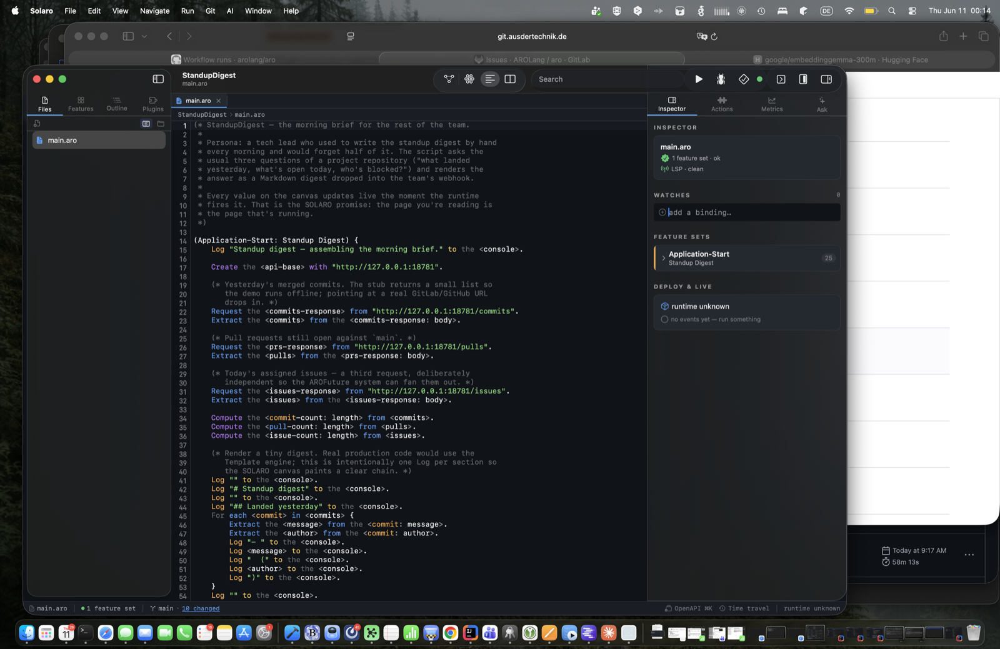
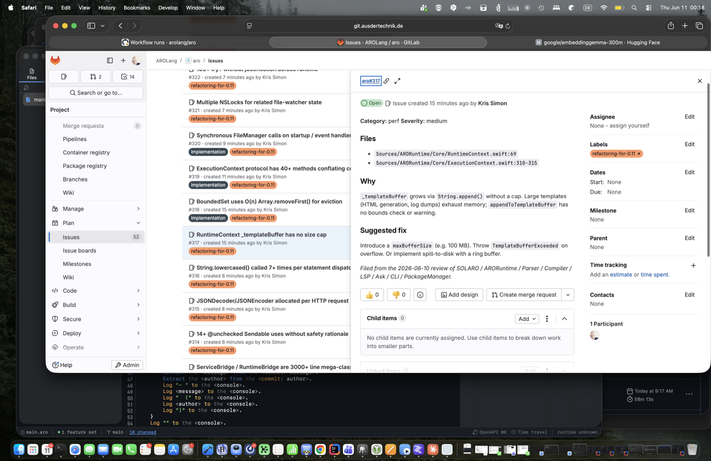

# SOLARO — The ARO Development Platform

**How an Integrated Editor Stops Lying About Your Code**

---

*Language version: 0.11.0 · June 2026*

---

## Abstract

Most editors call themselves "integrated" because they put a debugger,
a terminal, and a file tree in the same window. The integration ends
there: the code panel still shows source, the debugger still shows
values, and you stitch the picture together in your head. SOLARO
takes the word literally. The same canvas that draws your feature
sets paints them lit up as the runtime fires them. Every value, every
repository row, every event flows back onto the canvas the moment it
exists. The page you are reading is the page that is running.

This book is a tour of that idea. It walks through the user
interface, the day-to-day workflow of writing and running ARO,
the debug and test experience, and three stories — a tech lead's
morning standup digest, a freelancer's uptime monitor, and an indie
hacker's nightly repository backup — each of which is twelve to forty
lines of ARO that you can actually deploy. By the end you should know
what SOLARO is for, when to reach for it, and how to ship something
useful with it before lunch.

---

## 1. The shape of SOLARO

SOLARO opens to a Welcome view. From there you can open an existing
ARO project (any folder with a `main.aro` in it), create a new one
from a template, or jump back into something you had open before.

{ width=85% }

There are four panes. The **sidebar** on the left shows the project
tree and a search field; the **center pane** swaps between the
canvas, the code editor, and a split view of both; the **inspector**
on the right shows file-level metadata, the live problems list, and
when you're in the debugger, the variable inspector; the **console**
across the bottom is the runtime's stdout and stderr — plus, when the
runtime is producing JSONL events, the timeline.

{ width=85% }

The toolbar at the top groups its buttons into four pills: the
**pane-mode picker** (canvas / text / split / map), the **search
field**, the **run cluster** (Run, Debug, Test, status pip), and the
**view cluster** (fold toggle, minimap toggle, inspector toggle). On
narrow windows the pills collapse into the system `»` overflow one
at a time, right-most first, so the run cluster stays visible longer
than the toggles.

### 1.1 The canvas

The canvas is the centerpiece. Every feature set in your project is
a container; every statement inside it is a node; every connection
between statements (a `<variable>` produced by one and consumed by
another) is an edge. The layout engine arranges them so the flow
reads left to right, top to bottom. When you open a file the canvas
shows that file's feature sets; when you open an `openapi.yaml` it
shows the route / schema graph instead.

You can pan with two fingers, zoom with a pinch, double-click a node
to jump to its source line, right-click a feature set container to
rename or duplicate it, and drag any node anywhere — your positions
persist in a `.layout.json` next to the file so the picture survives
a `git pull`.

### 1.2 The code editor

The text pane is a real TextKit-2 editor (gutter, line numbers,
multi-cursor, the works). Syntax highlighting comes from the same
lexer the runtime uses, so a token coloured as a verb in the editor
is a verb to the parser. Breakpoints toggle with a single click in
the gutter. The find bar slides in from the top right with Cmd+F.

The split mode (toolbar's pane picker → `Split`) shows canvas and
code side by side; the divider is draggable from 200 to 1200 pt of
canvas width. Edits in the code panel flow to the canvas as soon as
the YAML / ARO parses cleanly; canvas-driven mutations (in
`openapi.yaml`: add route, add schema, rename, delete) flow back to
the editor immediately, no Save button needed.

### 1.3 The inspector

The inspector is a stack of cards. The top card is the file header
— name, parse status, LSP status. Below that, when you have a
canvas node selected, the **Selected Statement** card lets you edit
the statement inline; the runtime reparses the change on every
keystroke and reflows the canvas. The **Watches** card lets you pin
variables; **Problems** lists LSP diagnostics; **Feature Sets**
shows every FS in the current file with its role and signature.

{ width=85% }

For an `openapi.yaml`, the inspector swaps in an **OpenAPI editor**
when you select a route or schema node — an Xcode-style form that
writes back into the YAML on every change.

### 1.4 The console

The console is at the bottom. Three tabs: **Output** (stdout +
stderr from the running app), **Events** (the runtime's JSONL event
stream, one line per statement fired), and **Metrics** (a Prometheus-
style snapshot of the runtime's counters). The metrics tab is a raw
AppKit panel rather than SwiftUI because on macOS 26 SwiftUI
TimelineView snapshots through hosted views tripped the layout-
constraint cycle limit — a recurring theme in 0.10/0.11 (see the
`refactoring-for-0.11` issue label).

---

## 2. Setup

### 2.1 Installing

SOLARO ships as part of the ARO release on GitHub. Download
`Solaro.dmg` from the latest tagged release, drag it into
`/Applications`, and launch. On first run macOS will ask you to
confirm the developer; SOLARO is signed and notarized.

If you'd rather build from source:

```bash
git clone https://git.ausdertechnik.de/arolang/aro.git
cd aro
swift build -c release --product SolaroApp
.build/release/SolaroApp
```

The first build takes a few minutes (Swift NIO, MLX, libgit2,
STTextView, plus a couple of dozen smaller dependencies). After that
incremental rebuilds are seconds.

### 2.2 What gets installed

SOLARO is a single application bundle. It needs the `aro` CLI on
your path for run / debug / test / build — install the matching CLI
via Homebrew:

```bash
brew install arolang/tap/aro
```

…or copy `.build/release/aro` next to `Solaro.app/Contents/MacOS/`
during a development build. SOLARO probes for a mismatched binary at
launch and shows a banner if the CLI version disagrees with the app.

### 2.3 Optional bits

- **`aro ask`** uses a local language model. On Apple Silicon Macs
  SOLARO uses MLX directly; on Intel Macs or Linux it falls back to
  `llama-server` (auto-downloaded on first use, ~100 MB).
- **Plugins** install from Git URLs via `aro add github:org/repo` or
  from the in-app marketplace (Help → Plugins). The runtime supports
  Swift, Rust, C/C++, and Python plugin SDKs.
- **The book viewer** (Help → Books) downloads PDFs of every book in
  this project, including this one, on demand from the latest release.

---

## 3. Running, debugging, testing

The toolbar's run cluster has three big buttons: **Run**, **Debug**,
**Test**. Each one takes the same shape — the canvas pulses, values
appear inline on nodes, the console fills with output — but they end
in different places.

### 3.1 Run

`Run` (or Cmd+R) spawns the `aro run` subprocess against the open
project. The canvas highlights the **Application-Start** feature
set, then each statement node lights up briefly as the runtime fires
it. Values produced by an action (the `<result>` slot) appear under
the node and stay there until the next run.

This is the demo moment. Open `Examples/StandupDigest`, hit Run, and
watch the three `Request` nodes fan out, the three `Extract`s pull
the bodies, and the digest assembly walk down through the loops. No
print-tracing, no `console.log` archaeology — the program is the
trace.

### 3.2 Debug

`Debug` (or Cmd+Shift+R) launches the runtime in debug mode. Breakpoints
toggle by clicking the gutter or pressing F9 on a line. The
**Selected Statement** card in the inspector shows live
variable values when paused. **Step Over** (F10) and **Step Into**
(F11) advance one statement at a time; the canvas's pulse moves with
the cursor.

Because ARO statements are coarse compared to imperative steps,
stepping is more productive than in most debuggers. Each step
corresponds to a complete Action-Result-Object — a meaningful unit
of work — not an arbitrary lexical line.

### 3.3 Test

`Test` (or Cmd+U) runs `aro test`. Test feature sets — any FS whose
business activity ends in `Test` or `Tests` — are collected, run in
isolation, and their pass/fail markers appear next to each FS header
on the canvas. A test in progress shows a pulsing **T** chip; a
passed test goes green; a failure goes red and the canvas pins the
offending statement so you can click straight to it.

### 3.4 Run, debug, test from the CLI

Everything SOLARO does, the CLI does too:

```bash
aro run    ./Examples/StandupDigest
aro debug  ./Examples/StandupDigest
aro test   ./Examples/StandupDigest
aro check  ./Examples/StandupDigest        # syntax / semantic check
aro build  ./Examples/StandupDigest        # compile to a native binary
```

The CLI's output is the input that drives SOLARO's canvas. SOLARO is
the editor; `aro` is the runtime; the JSONL event stream between them
is the contract.

---

## 4. What "Integrated" actually means

The trick SOLARO is built around is this: the runtime emits one JSON
event per statement fired, on stderr, behind the `--debug-record`
flag. The flag is on whenever SOLARO is the parent. Each event
carries the file, line, feature set, statement index, the values
bound at that point, and the time elapsed. SOLARO's canvas observes
the stream and lights up the node whose `(file, line, index)` matches
each event. The blink is real — it's the runtime telling the editor
"I just ran this." The values on the canvas are real — they are the
runtime's own bindings, not a re-execution by SOLARO.

This matters more than it sounds. In every other editor the debugger
is a separate process, and asking it for values is a synchronous
round-trip that pauses the runtime. SOLARO never pauses (unless you
asked it to with a breakpoint). The canvas's live state is the
runtime's live state; the editor is *watching*, not *interrogating*.

The consequence at the human level: when something goes wrong, you
see *where* it went wrong before you see *what* went wrong. A node
that stays dark when the run finishes is a branch that never fired.
A node whose value differs from the one you expected is a bug whose
location and shape you already know.

{ width=85% }

The same mechanic powers the **repository overlay**. Any FS that
ends in `Observer` watches a repository; its node on the canvas
shows the current row count and the last-touched row inline. The
**event overlay** does the same for `Emit` and event handler FSes.
The map of values flowing through the program is the program.

---

## 5. Three stories

### 5.1 A tech lead's standup digest

> *Persona: someone who's been writing the standup digest by hand
> every morning for two years and would like ten minutes of their
> life back.*

The example lives at `Examples/StandupDigest`. Three GET requests,
three loops, a Markdown render, done. The whole feature set is
forty-two lines including comments:

```aro
(Application-Start: Standup Digest) {
    Log "Standup digest — assembling the morning brief." to the <console>.

    Request the <commits-response> from "http://127.0.0.1:18781/commits".
    Extract the <commits> from the <commits-response: body>.

    Request the <prs-response> from "http://127.0.0.1:18781/pulls".
    Extract the <pulls> from the <prs-response: body>.

    Request the <issues-response> from "http://127.0.0.1:18781/issues".
    Extract the <issues> from the <issues-response: body>.

    Compute the <commit-count: length> from <commits>.
    Compute the <pull-count: length> from <pulls>.
    Compute the <issue-count: length> from <issues>.

    Log "# Standup digest" to the <console>.
    Log "## Landed yesterday" to the <console>.
    For each <commit> in <commits> {
        Extract the <message> from the <commit: message>.
        Extract the <author>  from the <commit: author>.
        Log "- " to the <console>. Log <message> to the <console>.
        Log " (" to the <console>. Log <author>  to the <console>. Log ")" to the <console>.
    }
    (* …same shape for pulls and issues… *)

    Return an <OK: status> for the <digest>.
}
```

#### Why this is more useful than a shell script

The three `Request` calls are independent. ARO's lazy execution
model (every action returns a future, forced on first read) fans
them out automatically — they run in parallel, and the canvas shows
all three nodes pulsing at the same instant. The shell version of
this script would walk them in sequence and take three times longer
for no good reason.

The `Compute … length` calls show how the canvas shines on simple
programs. Each one's result appears under the node as soon as the
loop completes; when you tweak the stub data and re-run, the new
counts appear in place. Static-image documentation lies; this
doesn't.

#### Running it

```bash
# In one terminal, start the stub.
python3 Examples/StandupDigest/stub.py 18781

# In SOLARO, File → Open → Examples/StandupDigest → Run.
```

The digest assembles in milliseconds. Swap the stub URLs for your
real GitLab/GitHub endpoints (set `GITLAB_TOKEN` in the environment
and add the auth header in a `Request` config object) and you have
a real cron-able job.

### 5.2 A freelancer's uptime monitor

> *Persona: someone running three side-services who's tired of
> learning about outages from customers.*

`Examples/UptimeMonitor` is a list of URLs, a loop, and a
`CheckFailed` event handler:

```aro
(Application-Start: Uptime Monitor) {
    Create the <targets> with [
        "http://127.0.0.1:18791/healthy",
        "http://127.0.0.1:18791/flaky",
        "http://127.0.0.1:18791/down"
    ].

    For each <target> in <targets> {
        Request the <response> from <target>.
        Extract the <status> from the <response: status>.

        Create the <probe> with { target: <target>, status: <status> }.
        Store the <probe> into the <probe-repository>.

        Log "DOWN " to the <console> when <status> >= 400.
        Emit a <CheckFailed: event> with {
            target: <target>, status: <status>
        } when <status> >= 400.

        Log "OK  " to the <console> when <status> < 400.
    }

    Return an <OK: status> for the <sweep>.
}

(Send Alert: CheckFailed Handler) {
    Extract the <target> from the <event: target>.
    Log "ALERT issued for " to the <console>.
    Log <target> to the <console>.
    Return an <OK: status> for the <alert>.
}
```

#### What the canvas shows you

The `probe-repository` becomes a node on the canvas. Each row is a
probe; the latest row's `status` shows inline. Run it once with the
stub running; the `/down` URL pulses red, the `Send Alert` feature
set lights up, the alert message lands in the console.

The split between the probe loop and the alert handler matters: you
can swap the `Log` for a `Request` POST to your Slack webhook
without touching the monitoring code. ARO's events are the only
coupling between the two; nothing else needs to change. Adding a
fourth target — a new URL — is one line.

#### Running it

```bash
python3 Examples/UptimeMonitor/stub.py 18791
aro run Examples/UptimeMonitor
```

Hand the monitor to `launchd` / `systemd` / a `cron` line and you're
done; the script knows how to exit cleanly. Add a `Keepalive` and
wrap the body in a `Schedule … every 60 seconds` and the script
becomes a service.

### 5.3 An indie hacker's nightly repo backup

> *Persona: someone self-hosting a handful of projects who already
> set up a backup once and watched it silently fail for three
> months.*

`Examples/RepoBackup` is built around the Git actions (ARO-0080).
The whole script is one feature set:

```aro
(Application-Start: Repo Backup) {
    Create the <repos> with [
        { name: "aro",    url: "https://git.ausdertechnik.de/arolang/aro.git" },
        { name: "demo-1", url: "https://git.ausdertechnik.de/arolang/aro.git" },
        { name: "demo-2", url: "https://git.ausdertechnik.de/arolang/aro.git" }
    ].

    Compute the <today> from <now>.

    For each <repo> in <repos> {
        Extract the <name> from the <repo: name>.
        Extract the <url>  from the <repo: url>.
        Create the <destination> with "/tmp/backups/" + <today> + "/" + <name>.

        Log "Cloning " to the <console>. Log <name> to the <console>.

        Clone the <result> from the <git> with {
            url: <url>, path: <destination>
        }.

        Create the <backup> with { name: <name>, destination: <destination> }.
        Store the <backup> into the <backup-repository>.

        Log "Done " to the <console>. Log <name> to the <console>.
    }

    Return an <OK: status> for the <sweep>.
}
```

#### What you watch on the canvas

Each repo's `Clone` node lights up as libgit2 does the work; the
node next to it shows the path it wrote to. The `backup-repository`
accumulates a row per repo per night; if a clone fails, the node
goes red and the chain stops — you see the failure on the canvas
the moment it happens, without having to read a log file at 3am.

#### Running it

```bash
aro run Examples/RepoBackup
```

Wrap the body in a schedule and you have a service. Mount a real
backup target (S3, restic, borg) by replacing the `Log "Done"` with
a `Request` POST or a `Stage … to <git>` + `Commit … to <git>`
sequence — same canvas, same shape, an extra two lines.

---

## 6. Where to go from here

- **The Language Guide** is the long-form reference: every action,
  every qualifier, every scoping rule.
- **The Essential Primer** is the technical introduction to the
  language without the tooling.
- **ARO by Example** walks through every example in `Examples/` with
  commentary.
- **The Debugging Guide** goes deep on the runtime's JSONL event
  stream and how SOLARO consumes it — useful if you're writing your
  own editor integration.
- **The Plugin Guide** covers writing Swift, Rust, C, and Python
  plugins that show up as native actions in the canvas.

The book viewer (Help → Books) downloads every one of these PDFs on
demand. They all build from this same repo via `Book/*/build-pdf.sh`
and ship as artefacts on every tagged release.

---

## Colophon

SOLARO is built with SwiftUI on AppKit, talks to a Swift NIO-backed
runtime, embeds an STTextView code editor, drives an MLX or
llama-server backend for the `Ask` assistant, and uses libgit2 for
its Git surface. The canvas is a hand-rolled layout engine because
none of the off-the-shelf node-graph libraries did the live-value
overlay we wanted. The whole thing is open source under MIT.

If you ship something useful with SOLARO, we'd love to see it.
Open an issue, drop a screenshot in the Discussions tab, or — best
of all — send a pull request adding your project to
`Examples/`. The next person looking for a starting point will
thank you.
