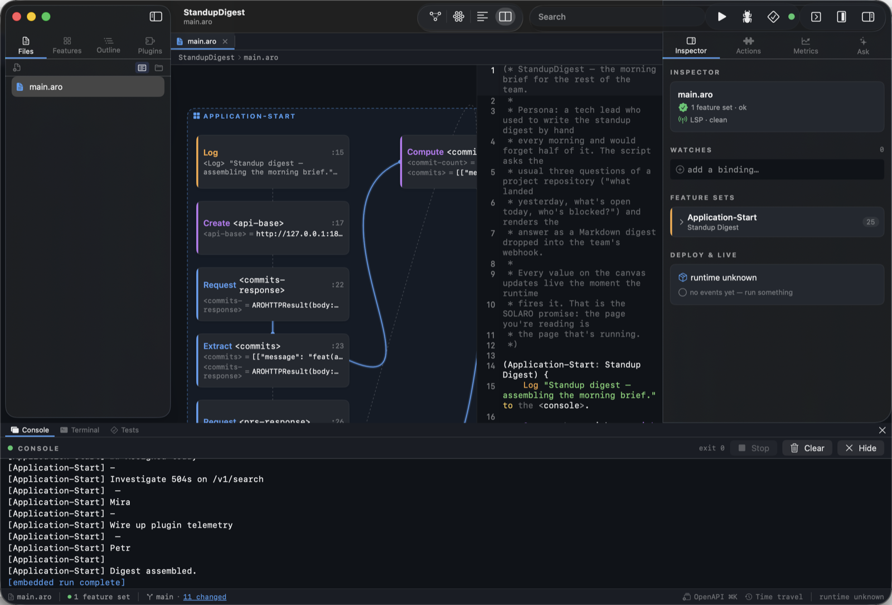
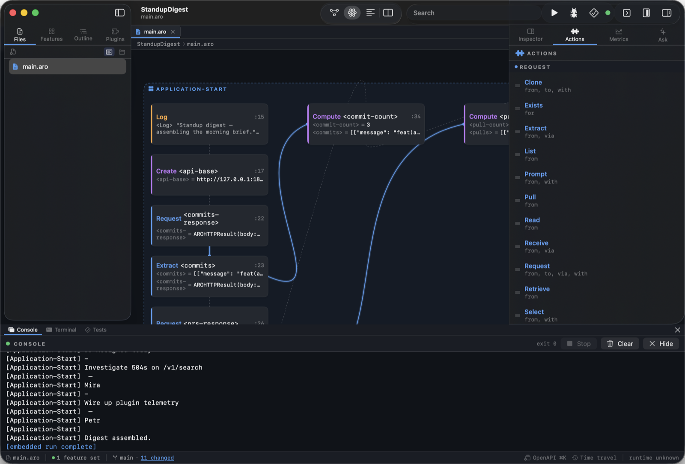
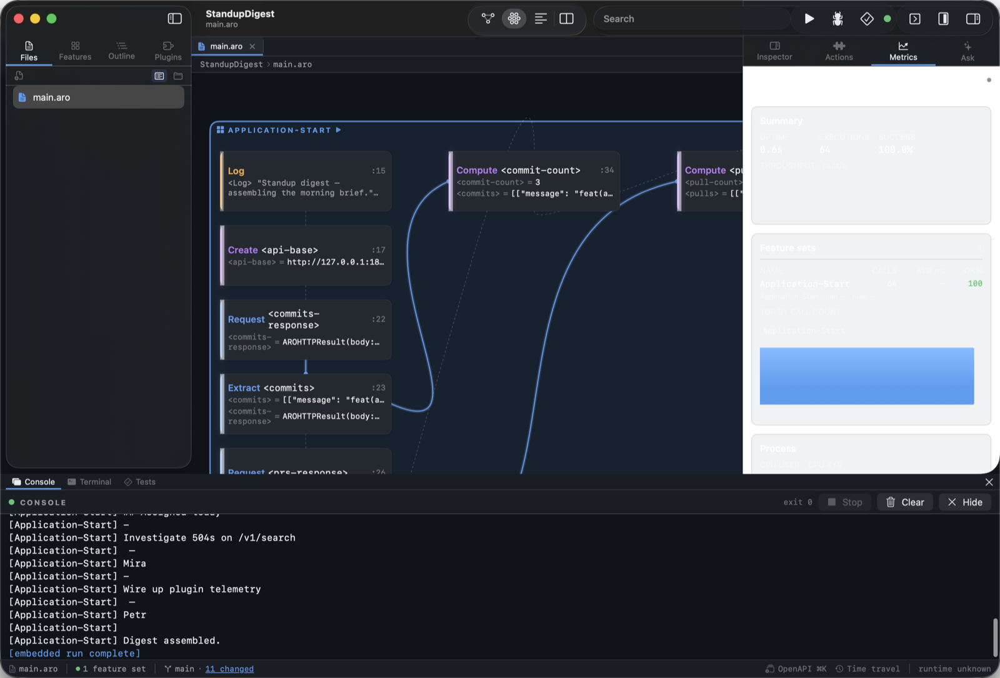
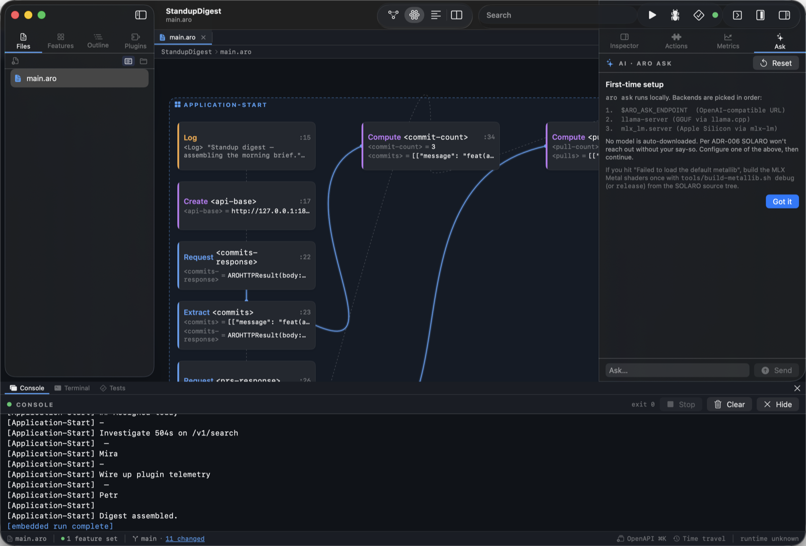
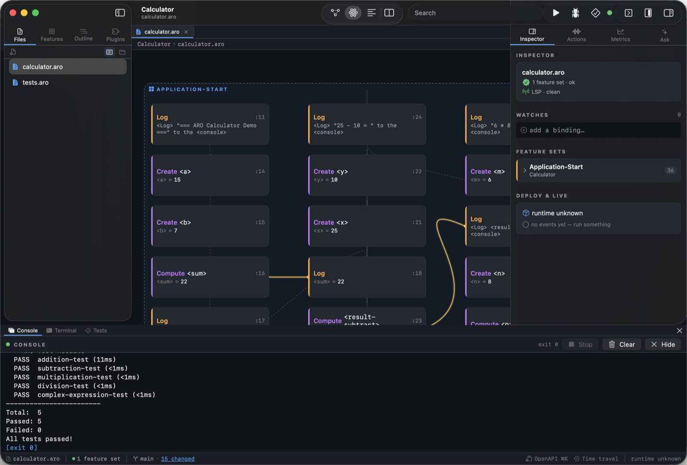
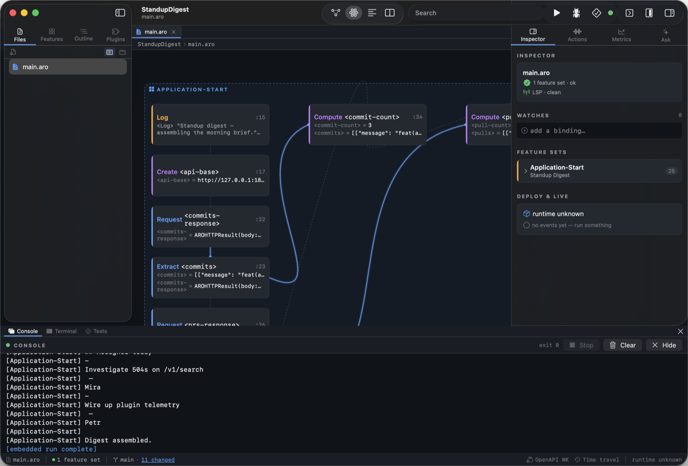
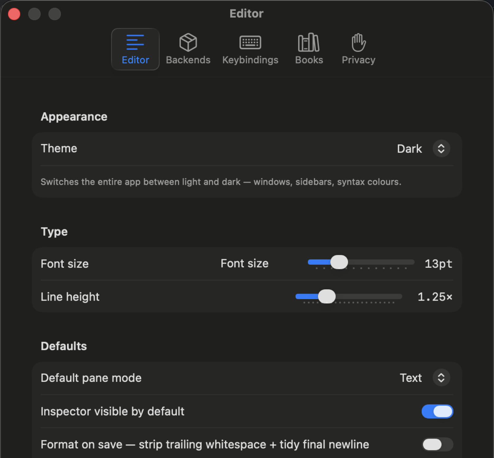

# SOLARO — The ARO Development Platform

**How an Integrated Editor Stops Lying About Your Code**

---

*Language version: 0.11.0 · June 2026*

---

## Abstract

Most editors call themselves "integrated" because they put a debugger,
a terminal, and a file tree in the same window. The integration ends
there: the code panel still shows source, the debugger still shows
values, and you stitch the picture together in your head. SOLARO
takes the word literally. The same canvas that draws your feature
sets paints them lit up as the runtime fires them. Every value, every
repository row, every event flows back onto the canvas the moment it
exists. The page you are reading is the page that is running.

This book is a tour of that idea. It walks through the user
interface, the day-to-day workflow of writing and running ARO,
the debug and test experience, and two stories — a freelancer's
uptime monitor and an indie hacker's nightly repository backup —
each of which is twelve to forty lines of ARO that you can actually
deploy. By the end you should know
what SOLARO is for, when to reach for it, and how to ship something
useful with it before lunch.

---

## 1. The shape of SOLARO

SOLARO opens to a Welcome view. From there you can open an existing
ARO project (any folder with a `main.aro` in it), create a new one
from a template, or jump back into something you had open before.

{ width=85% }

There are four panes. The **sidebar** on the left shows the project
tree and a search field; the **center pane** swaps between the
canvas, the code editor, and a split view of both; the **inspector**
on the right shows file-level metadata, the live problems list, and
when you're in the debugger, the variable inspector; the **console**
across the bottom is the runtime's stdout and stderr — plus, when the
runtime is producing JSONL events, the timeline.

{ width=85% }

The toolbar at the top groups its buttons into four pills: the
**pane-mode picker** (canvas / text / split / map), the **search
field**, the **run cluster** (Run, Debug, Test, status pip), and the
**view cluster** (fold toggle, minimap toggle, inspector toggle). On
narrow windows the pills collapse into the system `»` overflow one
at a time, right-most first, so the run cluster stays visible longer
than the toggles.

### 1.1 The canvas

The canvas is the centerpiece. Every feature set in your project is
a container; every statement inside it is a node; every connection
between statements (a `<variable>` produced by one and consumed by
another) is an edge. The layout engine arranges them so the flow
reads left to right, top to bottom. When you open a file the canvas
shows that file's feature sets; when you open an `openapi.yaml` it
shows the route / schema graph instead.

You can pan with two fingers, zoom with a pinch, double-click a node
to jump to its source line, right-click a feature set container to
rename or duplicate it, and drag any node anywhere — your positions
persist in a `.layout.json` next to the file so the picture survives
a `git pull`.

### 1.2 The code editor

Syntax highlighting comes from the same
lexer the runtime uses, so a token coloured as a verb in the editor
is a verb to the parser. Breakpoints toggle with a single click in
the gutter. The find bar slides in from the top right with Cmd+F.

The split mode (toolbar's pane picker → `Split`) shows canvas and
code side by side; drag the divider to give either side more room.
Edits in the code panel flow to the canvas as soon as
the YAML / ARO parses cleanly; canvas-driven mutations (in
`openapi.yaml`: add route, add schema, rename, delete) flow back to
the editor immediately, no Save button needed.

{ width=85% }

### 1.3 The inspector

The inspector is a stack of cards. The top card is the file header
— name, parse status, LSP status. Below that, when you have a
canvas node selected, the **Selected Statement** card lets you edit
the statement inline; the runtime reparses the change on every
keystroke and reflows the canvas. The **Watches** card lets you pin
variables; **Problems** lists LSP diagnostics; **Feature Sets**
shows every FS in the current file with its role and signature.

{ width=85% }

For an `openapi.yaml`, the inspector swaps in an **OpenAPI editor**
when you select a route or schema node — an Xcode-style form that
writes back into the YAML on every change.

### 1.4 The console

The console is at the bottom. Three tabs: **Output** (stdout +
stderr from the running app), **Events** (the runtime's JSONL event
stream, one line per statement fired), and **Metrics** (a Prometheus-
style snapshot of the runtime's counters).

### 1.5 The right rail

The right rail is a four-tab strip above the inspector. Each tab
swaps the entire right pane for a focused tool:

- **Inspector** (default) — the cards described above.
- **Actions** — every action the runtime can dispatch, grouped by
  semantic role (REQUEST, OWN, RESPONSE, EXPORT, SERVICE), with the
  built-ins separated from each loaded plugin's contributions. Each
  row is a drag source: drop it on a feature-set container in the
  canvas and SOLARO inserts a placeholder ARO statement at the
  cursor. The header counts what's loaded ("48 built-in · 12 from 3
  plugins") and a tiny spinner blinks while `aro actions` is in
  flight.
- **Metrics** — see §6.
- **Ask** — see §7.

{ width=85% }

---

## 2. Setup

### 2.1 Installing

SOLARO ships as part of the ARO release on GitHub. Download
`Solaro.dmg` from the latest tagged release, drag it into
`/Applications`, and launch. On first run macOS will ask you to
confirm the developer; SOLARO is signed and notarized.

If you'd rather build from source:

```bash
git clone https://git.ausdertechnik.de/arolang/aro.git
cd aro
swift build -c release --product SolaroApp
.build/release/SolaroApp
```

The first build takes a few minutes (Swift NIO, MLX, libgit2,
STTextView, plus a couple of dozen smaller dependencies). After that
incremental rebuilds are seconds.

### 2.2 What gets installed

SOLARO is a single application bundle. It needs the `aro` CLI on
your path for run / debug / test / build — install the matching CLI
via Homebrew:

```bash
brew install arolang/tap/aro
```

…or copy `.build/release/aro` next to `Solaro.app/Contents/MacOS/`
during a development build. SOLARO probes for a mismatched binary at
launch and shows a banner if the CLI version disagrees with the app.

### 2.3 Optional bits

- **`aro ask`** uses a local language model. On Apple Silicon Macs
  SOLARO uses MLX directly; on Intel Macs or Linux it falls back to
  `llama-server` (auto-downloaded on first use, ~100 MB).
- **Plugins** install from Git URLs via `aro add github:org/repo` or
  from the in-app marketplace (Help → Plugins). The runtime supports
  Swift, Rust, C/C++, and Python plugin SDKs.
- **The book viewer** (Help → Books) downloads PDFs of every book in
  this project, including this one, on demand from the latest release.

---

## 3. Running, debugging, testing

The toolbar's run cluster has three big buttons: **Run**, **Debug**,
**Test**. Each one takes the same shape — the canvas pulses, values
appear inline on nodes, the console fills with output — but they end
in different places.

### 3.1 Run

`Run` (or Cmd+R) spawns the `aro run` subprocess against the open
project. The canvas highlights the **Application-Start** feature
set, then each statement node lights up briefly as the runtime fires
it. Values produced by an action (the `<result>` slot) appear under
the node and stay there until the next run.

This is the demo moment. Open `Examples/UptimeMonitor`, hit Run, and
watch each `Request` node fire as the loop walks the URL list, the
`CheckFailed` handler light up the instant a probe fails, and the
alert message land in the console. No print-tracing, no `console.log`
archaeology — the program is the trace.

### 3.2 Debug

`Debug` (or Cmd+Shift+R) launches the runtime in debug mode. Breakpoints
toggle by clicking the gutter or pressing F9 on a line. The
**Selected Statement** card in the inspector shows live
variable values when paused. **Step Over** (F10) and **Step Into**
(F11) advance one statement at a time; the canvas's pulse moves with
the cursor.

Because ARO statements are coarse compared to imperative steps,
stepping is more productive than in most debuggers. Each step
corresponds to a complete Action-Result-Object — a meaningful unit
of work — not an arbitrary lexical line.

### 3.3 Test

`Test` (or Cmd+U) runs `aro test`. Test feature sets — any FS whose
business activity ends in `Test` or `Tests` — are collected, run in
isolation, and their pass/fail markers appear next to each FS header
on the canvas. A test in progress shows a pulsing **T** chip; a
passed test goes green; a failure goes red and the canvas pins the
offending statement so you can click straight to it.

### 3.4 Run, debug, test from the CLI

Everything SOLARO does, the CLI does too:

```bash
aro run    ./Examples/UptimeMonitor
aro debug  ./Examples/UptimeMonitor
aro test   ./Examples/UptimeMonitor
aro check  ./Examples/UptimeMonitor        # syntax / semantic check
aro build  ./Examples/UptimeMonitor        # compile to a native binary
```

The CLI's output is the input that drives SOLARO's canvas. SOLARO is
the editor; `aro` is the runtime; the JSONL event stream between them
is the contract.

---

## 4. What "Integrated" actually means

The trick SOLARO is built around is this: the runtime emits one JSON
event per statement fired, on stderr, behind the `--debug-record`
flag. The flag is on whenever SOLARO is the parent. Each event
carries the file, line, feature set, statement index, the values
bound at that point, and the time elapsed. SOLARO's canvas observes
the stream and lights up the node whose `(file, line, index)` matches
each event. The blink is real — it's the runtime telling the editor
"I just ran this." The values on the canvas are real — they are the
runtime's own bindings, not a re-execution by SOLARO.

This matters more than it sounds. In every other editor the debugger
is a separate process, and asking it for values is a synchronous
round-trip that pauses the runtime. SOLARO never pauses (unless you
asked it to with a breakpoint). The canvas's live state is the
runtime's live state; the editor is *watching*, not *interrogating*.

The consequence at the human level: when something goes wrong, you
see *where* it went wrong before you see *what* went wrong. A node
that stays dark when the run finishes is a branch that never fired.
A node whose value differs from the one you expected is a bug whose
location and shape you already know.

{ width=85% }

The same mechanic powers the **repository overlay**. Any FS that
ends in `Observer` watches a repository; its node on the canvas
shows the current row count and the last-touched row inline. The
**event overlay** does the same for `Emit` and event handler FSes.
The map of values flowing through the program is the program.

---

## 5. Two stories

### 5.1 A freelancer's uptime monitor

> *Persona: someone running three side-services who's tired of
> learning about outages from customers.*

`Examples/UptimeMonitor` is a list of URLs, a loop, and a
`CheckFailed` event handler:

```aro
(Application-Start: Uptime Monitor) {
    Create the <targets> with [
        "http://127.0.0.1:18791/healthy",
        "http://127.0.0.1:18791/flaky",
        "http://127.0.0.1:18791/down"
    ].

    For each <target> in <targets> {
        Request the <response> from <target>.
        Extract the <status> from the <response: status>.

        Create the <probe> with { target: <target>, status: <status> }.
        Store the <probe> into the <probe-repository>.

        Log "DOWN " to the <console> when <status> >= 400.
        Emit a <CheckFailed: event> with {
            target: <target>, status: <status>
        } when <status> >= 400.

        Log "OK  " to the <console> when <status> < 400.
    }

    Return an <OK: status> for the <sweep>.
}

(Send Alert: CheckFailed Handler) {
    Extract the <target> from the <event: target>.
    Log "ALERT issued for " to the <console>.
    Log <target> to the <console>.
    Return an <OK: status> for the <alert>.
}
```

#### What the canvas shows you

The `probe-repository` becomes a node on the canvas. Each row is a
probe; the latest row's `status` shows inline. Run it once with the
stub running; the `/down` URL pulses red, the `Send Alert` feature
set lights up, the alert message lands in the console.

The split between the probe loop and the alert handler matters: you
can swap the `Log` for a `Request` POST to your Slack webhook
without touching the monitoring code. ARO's events are the only
coupling between the two; nothing else needs to change. Adding a
fourth target — a new URL — is one line.

#### Running it

```bash
python3 Examples/UptimeMonitor/stub.py 18791
aro run Examples/UptimeMonitor
```

Hand the monitor to `launchd` / `systemd` / a `cron` line and you're
done; the script knows how to exit cleanly. Add a `Keepalive` and
wrap the body in a `Schedule … every 60 seconds` and the script
becomes a service.

### 5.2 An indie hacker's nightly repo backup

> *Persona: someone self-hosting a handful of projects who already
> set up a backup once and watched it silently fail for three
> months.*

`Examples/RepoBackup` is built around the Git actions (ARO-0080).
The whole script is one feature set:

```aro
(Application-Start: Repo Backup) {
    Create the <repos> with [
        { name: "aro",    url: "https://git.ausdertechnik.de/arolang/aro.git" },
        { name: "demo-1", url: "https://git.ausdertechnik.de/arolang/aro.git" },
        { name: "demo-2", url: "https://git.ausdertechnik.de/arolang/aro.git" }
    ].

    Compute the <today> from <now>.

    For each <repo> in <repos> {
        Extract the <name> from the <repo: name>.
        Extract the <url>  from the <repo: url>.
        Create the <destination> with "/tmp/backups/" + <today> + "/" + <name>.

        Log "Cloning " to the <console>. Log <name> to the <console>.

        Clone the <result> from the <git> with {
            url: <url>, path: <destination>
        }.

        Create the <backup> with { name: <name>, destination: <destination> }.
        Store the <backup> into the <backup-repository>.

        Log "Done " to the <console>. Log <name> to the <console>.
    }

    Return an <OK: status> for the <sweep>.
}
```

#### What you watch on the canvas

Each repo's `Clone` node lights up while the clone runs; the
node next to it shows the path it wrote to. The `backup-repository`
accumulates a row per repo per night; if a clone fails, the node
goes red and the chain stops — you see the failure on the canvas
the moment it happens, without having to read a log file at 3am.

#### Running it

```bash
aro run Examples/RepoBackup
```

Wrap the body in a schedule and you have a service. Mount a real
backup target (S3, restic, borg) by replacing the `Log "Done"` with
a `Request` POST or a `Stage … to <git>` + `Commit … to <git>`
sequence — same canvas, same shape, an extra two lines.

---

## 6. Metrics — call counts and execution time

Press the **Metrics** tab in the right-rail tab strip while a
project is running and the panel switches to a Prometheus-style
snapshot of the runtime's counters. Every feature set the runtime
has dispatched in the current session shows up as one row.

{ width=85% }

For each feature set the panel shows:

- **Calls** — how many times the runtime has entered the FS in this
  session. Incremented on every event the FS is registered for, on
  every HTTP request that matched its operationId, on every
  scheduled tick.
- **Avg ms** — mean wall-clock time spent inside the FS, including
  any awaited futures it forced. Sub-millisecond paths display as
  `<1`; the metric is exact above 1 ms.
- **p95 ms** — the 95th-percentile latency, computed over a sliding
  window of the last 200 invocations. The window resets when you
  hit Run again so a hot-fix iteration doesn't fight the previous
  run's outliers.
- **Last ms** — the most recent invocation's latency. Useful when
  you're poking at a single FS via curl and want to see the number
  change per request without averaging.

The panel updates once a second from the runtime's `/metrics`
socket, so the numbers tick live while your app runs.

Application-Start and Application-End sit at the top so the
totalised startup / shutdown numbers don't drift away as more
handlers accumulate. The "Reset" button in the panel's header wipes
all counters without restarting the runtime — useful when you've
just finished warming caches and want a clean window for the next
measurement.

The same data is available externally: the runtime exposes a
Prometheus-style scrape endpoint on a UNIX socket
(`$XDG_RUNTIME_DIR/aro-metrics-<pid>.sock` by default) so any
Grafana or VictoriaMetrics agent can pull from it. SOLARO uses the
same socket; the Metrics tab is just a thin reader on top.

---

## 7. The Ask assistant

Switch the right rail to **Ask** to get a local-first co-pilot
backed by `aro ask`. The panel is a chat surface — your prompts
on the right, the assistant's responses on the left — and a
single-line input at the bottom.

{ width=85% }

The first prompt in a session shows a disclaimer card describing
where the model runs (locally via MLX on Apple Silicon, locally
via llama-server elsewhere, or against an OpenAI-compatible URL
if you've set `ARO_ASK_ENDPOINT` in Settings → Backends) and
asking you to confirm. After that, prompts go straight through.

What the assistant can see:

- The currently-open ARO project's source files, via tool calls.
- Any compiler diagnostics surfaced by the LSP.
- The runtime's recent JSONL event stream (if a run is in flight).
- Nothing else. There is no telemetry, no cloud upload of source,
  no third-party MCP call unless you explicitly install one.

What you can ask it for:

- "Explain this feature set" / "What does `Compute the
  <commit-count: length>` do?" — single-shot Q&A about ARO syntax
  or the project.
- "Add a CheckPassed event handler that logs to /tmp/passed.log"
  — the assistant emits a diff against the current file and the
  panel offers an Apply button.
- "Run aro test" — tool calls. The assistant proposes the command,
  asks for approval (per ADR-006 the gate is binary today; see
  GitLab issue #370 for the proposed severity tiers), and pipes
  the output back into the chat.

Cancel a long answer with the stop button in the input row. The
panel keeps the conversation in memory only — there's no on-disk
transcript by design.

---

## 8. Tests and test results

`aro test` discovers every feature set whose business activity
ends in `Test` or `Tests`, runs them in isolation, and reports
pass/fail per FS. SOLARO surfaces the results in three places at
once.

{ width=85% }

- **The canvas.** Test feature sets render a small pill on their
  header line (a green `T`, a red `T`, or a pulsing one while
  the runtime is inside them). Click the pill to jump to the
  test's first failing statement.
- **The editor gutter.** While a test FS is selected, every line
  inside it gets a row-coloured marker matching the result —
  green where the test passed, red where the runner pinned the
  failure. Breakpoint dots take precedence.
- **The inspector.** A `Test results` card lists every FS with
  its outcome and last-run latency. Failures get the runner's
  error message inline; passing FSes collapse to a single
  green row so the list stays readable on a project with dozens
  of tests.

Hitting `Test` (or `Cmd+U`) re-runs the suite. Re-runs are
incremental — only test FSes whose source file has changed since
the last green run actually execute. To force a full sweep, use
View → Tests → Re-run all.

Test discovery is purely naming-based: any feature set whose
business activity is `…Test` or `…Tests` is a test. The Given /
When / Then split is just normal ARO statements; nothing about
the runtime treats them specially. That means you can step into
them with the debugger the same way you step into production
code.

---

## 9. Business features (feature sets) at a glance

ARO programs are organised as **feature sets** — named bundles of
ARO statements tagged with a business activity. The activity is the
"why" of the feature set: `Order Management`, `User API`,
`Uptime Monitor`, `CheckFailed Handler`. SOLARO uses the activity
as the primary navigation axis.

The inspector's **Feature sets** card lists every FS in the open
file with its business activity, role badge, and the count of
statements inside. Click one to scroll the canvas to its
container.

{ width=85% }

A few activity suffixes have special meanings that SOLARO
visualises:

- `Handler` — event handler. Edges from `Emit` statements that
  produce its event animate when an event fires.
- `Observer` — repository observer. The FS's container draws an
  edge to the watched repository's node on the canvas.
- `Test` / `Tests` — picked up by `aro test`. See §8.
- `Action` — user-defined action (ARO-0081). Callable from
  anywhere as `Application.<Name>`; SOLARO shows the call-site
  edges in the same colour as plugin actions.

Everything else is a regular business feature — the FS the user
notice in production logs, the FS your team writes about in PR
descriptions. SOLARO's status bar also reports the project's
feature-set count and which ones changed since the last `git
commit`, so a `git pull` followed by a glance at the canvas tells
you exactly which slice of the business logic moved.

---

## 10. Settings

Cmd+, opens Settings. The window is six tabs, each focused on one
configurable surface; everything is stored under the `solaro.*`
keyspace in standard `UserDefaults` so backing it up is `defaults
export com.arolang.SOLARO`.

{ width=85% }

### 10.1 Editor

- **Theme** — Light, Dark, or System. Switches the entire app
  including syntax colours; no restart needed.
- **Font size** (10–22 pt) and **Line height** (1.00–2.00×) — apply
  to the code editor only; the canvas and inspector follow the
  system text size.
- **Default pane mode** — which of Canvas / Text / Split / Map a
  freshly-opened file lands in before its `.layout.json` overrides.
- **Inspector visible by default** — whether the right rail starts
  open. Independent from per-file persistence.
- **Format on save** — strips trailing whitespace and tidies the
  final newline on `Cmd+S`. Off by default because the runtime
  doesn't care about either.
- **Inline suggestions** — show LSP completions as ghost text
  inside the editor; `Tab` accepts.
- **Suggestion delay** — how long after a keystroke to fire the
  completion request, 0.2–3.0 s.
- **AI fallback** — once the completion popover has been open a
  second, also call `aro ask` for a longer prediction. Off by
  default; the assistant runs locally but it still takes seconds.

### 10.2 Backends

- **Runtime backend** — embedded (in-process via XPC, fastest for
  short scripts), subprocess (one `aro` per Run, the conservative
  default), or external (point at a remote runtime over the
  control socket). The blurb beneath the picker reminds you which
  is selected and what it implies.
- **`SOLARO_ARO` override** — empty means autoresolve (repo build
  → `/usr/local` → Homebrew → `$PATH`). Set to a path to pin a
  specific binary; useful when you're hacking on the runtime and
  the build artefact lives somewhere weird.
- **`ARO_ASK_ENDPOINT`** — empty means let `aro ask` pick a
  backend (MLX → llama-server → `mlx_lm.server`). Set to an
  OpenAI-compatible URL to use a hosted model instead.
- **Plugin marketplace** — optional GitHub PAT. Raises the
  marketplace's `topic:aro topic:plugin` API rate limit from 60
  to 5000 requests / hour. Stored in your local defaults; never
  uploaded.

### 10.3 Keybindings

A two-column editor for every command SOLARO exposes. The left
column is the command name and its current shortcut; the right
column lets you capture a new one. The Reset button clears a
binding back to the default. The full mapping is saved to
`~/.config/solaro/keybindings.json` so it's portable.

### 10.4 Books

The catalogue of available books with status (cached, never
downloaded, refresh available). The "Refresh now" button forces
a redownload from the latest GitHub release. The library is what
Help → Books reads.

### 10.5 Privacy

A summary of what SOLARO collects: nothing. Per ADR-007 and
ADR-010 there's no telemetry; the panel surfaces buttons to
reveal the local crash-report directory and to clear it.

### 10.6 Plugins (in-window)

Help → Plugins opens a separate window with the marketplace
fetched from GitHub's topic search, your installed plugins, and a
pane for the plugin you're currently inspecting. Installing a
plugin from there is one click; under the hood it runs `aro add
github:owner/repo` and reloads the runtime.

---

## 11. Where to go from here

- **The Language Guide** is the long-form reference: every action,
  every qualifier, every scoping rule.
- **The Essential Primer** is the technical introduction to the
  language without the tooling.
- **ARO by Example** walks through every example in `Examples/` with
  commentary.
- **The Debugging Guide** goes deep on the runtime's JSONL event
  stream and how SOLARO consumes it — useful if you're writing your
  own editor integration.
- **The Plugin Guide** covers writing Swift, Rust, C, and Python
  plugins that show up as native actions in the canvas.

The book viewer (Help → Books) downloads every one of these PDFs on
demand. They all build from this same repo via `Book/*/build-pdf.sh`
and ship as artefacts on every tagged release.

---

## Colophon

SOLARO is built with SwiftUI on AppKit, talks to a Swift NIO-backed
runtime, embeds an STTextView code editor, drives an MLX or
llama-server backend for the `Ask` assistant, and uses libgit2 for
its Git surface. The canvas is a hand-rolled layout engine because
none of the off-the-shelf node-graph libraries did the live-value
overlay we wanted. The whole thing is open source under MIT.

If you ship something useful with SOLARO, we'd love to see it.
Open an issue, drop a screenshot in the Discussions tab, or — best
of all — send a pull request adding your project to
`Examples/`. The next person looking for a starting point will
thank you.
