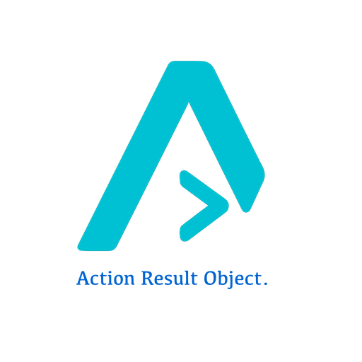

# The ARO Programming Language

| **Website:** https://krissimon.github.io/aro/<br />Reference implementation of a parser, compiler, and runtime for the **ARO** programming language. |  |
|---------------------------------------------------------------------------------------------------------|----------------------------------------|

## Overview

ARO is a declarative language for specifying business features in a human-readable format 
that can be compiled and executed. Features are expressed as Action-Result-Object statements.

### Key Features

- **Event-Driven Execution**: Feature sets are triggered by events, not direct calls
- **Application Lifecycle**: `Application-Start` (required), `Application-End: Success/Error` (optional)
- **HTTP Server**: Built-in web server using SwiftNIO
- **HTTP Client**: Outgoing HTTP requests via AsyncHTTPClient
- **File System**: File I/O and directory watching via FileMonitor
- **Socket Communication**: TCP server and client support
- **Extensible Actions**: Plugin architecture for custom actions

### Example

```aro
(* Entry point - exactly one per application *)
(Application-Start: My Service) {
    <Start> the <http-server> on port 8080.
    <Return> an <OK: status> for the <startup>.
}

(* Exit handler - called on graceful shutdown *)
(Application-End: Success) {
    <Log> the <shutdown: message> for the <console> with "Goodbye!".
    <Return> an <OK: status> for the <shutdown>.
}

(* HTTP route handler - triggered by GET /users event *)
(GET /users: User API) {
    <Retrieve> the <users> from the <user-repository>.
    <Return> an <OK: status> with <users>.
}

(* Event handler - triggered by UserCreated event *)
(Send Welcome Email: UserCreated Handler) {
    <Extract> the <user> from the <event: user>.
    <Send> the <welcome-email> to the <user: email>.
    <Return> an <OK: status> for the <notification>.
}
```

## Project Structure

```
AROParser/
├── Package.swift           # Swift package manifest
├── README.md               # This file
├── TODO.md                 # Roadmap and feature tracking
├── Sources/
│   ├── AROParser/          # Core parser library
│   │   ├── SourceLocation.swift    # Position tracking
│   │   ├── Token.swift             # Lexical tokens
│   │   ├── AST.swift               # Abstract syntax tree
│   │   ├── Errors.swift            # Error types
│   │   ├── Lexer.swift             # Tokenizer
│   │   ├── Parser.swift            # Recursive descent parser
│   │   ├── SymbolTable.swift       # Symbol management
│   │   ├── SemanticAnalyzer.swift  # Semantic analysis
│   │   ├── Compiler.swift          # Main compilation pipeline
│   │   └── Exports.swift           # Public API
│   ├── ARORuntime/         # Runtime execution engine
│   │   ├── Actions/                # Action system
│   │   ├── Core/                   # Execution engine
│   │   ├── Events/                 # Event bus
│   │   ├── HTTP/                   # HTTP server & client
│   │   ├── FileSystem/             # File operations
│   │   ├── Sockets/                # TCP communication
│   │   └── Application/            # App lifecycle
│   └── AROCLI/             # Command-line interface
│       ├── main.swift
│       └── Commands/               # run, compile, check
├── Examples/               # Example applications
│   ├── HelloWorld/         # Single-file example
│   ├── HTTPServer/         # HTTP server example
│   ├── FileWatcher/        # File monitoring example
│   ├── EchoSocket/         # Socket example
│   └── UserService/        # Multi-file application example
│       ├── main.aro        # Application-Start entry point
│       ├── users.aro       # HTTP route handlers
│       └── events.aro      # Event handlers
├── Documentation/          # Developer guides
│   └── ActionDeveloperGuide.md
├── Tests/
│   └── AROParserTests/     # Unit tests
└── Proposals/              # Language Evolution Proposals
    ├── ARO-0001 through 0019  # Core language
    └── ARO-0020 through 0025  # Runtime architecture
```

## Language Specification

The complete language is specified in 25 Evolution Proposals:

### Core Language (0001-0019)

| # | Proposal | Description |
|---|----------|-------------|
| 0001 | Core Syntax | Basic grammar, ARO statements, feature sets |
| 0002 | Literals & Expressions | Numbers, strings, operators |
| 0003 | Variable Scoping | Visibility, lifetime, publish mechanism |
| 0004 | Conditional Branching | if/then/else, when, match |
| 0005 | Iteration & Loops | for-each, while, repeat-until |
| 0006 | Type System | Types, generics, protocols |
| 0007 | Modules & Imports | Module system, packages |
| 0008 | Error Handling | try/catch, Result, guards |
| 0009 | Action Implementations | Action protocol, code generation |
| 0010 | Annotations | @doc, @validate, @route |
| 0011 | Concurrency | async/await, actors, channels |
| 0012 | Events & Reactive | Event sourcing, sagas |
| 0013 | State Machines | States, transitions |
| 0014 | Domain Modeling | DDD constructs |
| 0015 | Testing Framework | BDD, mocking |
| 0016 | Interoperability | Swift, REST, databases |
| 0017 | Macros | Metaprogramming, DSLs |
| 0018 | Query Language | SQL-like queries |
| 0019 | Standard Library | Core utilities |

### Runtime Architecture (0020-0025)

| # | Proposal | Description |
|---|----------|-------------|
| 0020 | Runtime Architecture | Execution engine, contexts, services |
| 0021 | HTTP Server | SwiftNIO web server, routing |
| 0022 | HTTP Client | AsyncHTTPClient, API consumption |
| 0023 | File System | File I/O, FileMonitor integration |
| 0024 | Sockets | TCP server/client, bidirectional |
| 0025 | Action Extension | Custom action development |

See [Proposals/README.md](Proposals/README.md) for details.

## Building

```bash
# Build
swift build

# Run tests
swift test

# Run an example application
aro run ./Examples/HelloWorld
```

## Usage

### Running Applications

```bash
# Run an ARO application
aro run ./Examples/HTTPServer

# Servers use the <Keepalive> action to stay running
# No --keep-alive flag needed

# Compile only (check for errors)
aro compile ./MyApp

# Quick syntax check
aro check ./MyApp
```

### As a Library

```swift
import AROParser
import ARORuntime

// Compile source code
let source = """
(Application-Start: My App) {
    <Log> the <startup: message> for the <console> with "Hello, ARO!".
    <Return> an <OK: status> for the <startup>.
}
"""

let result = Compiler.compile(source)

if result.isSuccess {
    // Execute the compiled program
    let app = Application(programs: [result.analyzedProgram])
    try await app.run()
} else {
    for diagnostic in result.diagnostics {
        print("\(diagnostic.severity): \(diagnostic.message)")
    }
}
```

### Creating Custom Actions

```swift
import ARORuntime

public struct MyCustomAction: ActionImplementation {
    public static let role: ActionRole = .own
    public static let verbs: Set<String> = ["MyVerb"]
    public static let validPrepositions: Set<Preposition> = [.with]

    public init() {}

    public func execute(
        result: ResultDescriptor,
        object: ObjectDescriptor,
        context: ExecutionContext
    ) async throws -> any Sendable {
        // Implementation
        return "result"
    }
}

// Register the action
ActionRegistry.shared.register(MyCustomAction.self)
```

See [Documentation/ActionDeveloperGuide.md](Documentation/ActionDeveloperGuide.md) for full details.

## Architecture

### Compilation & Execution Pipeline

```
Source Code
    │
    ▼
┌─────────┐
│  Lexer  │ ──► Tokens
└────┬────┘
     │
     ▼
┌─────────┐
│ Parser  │ ──► AST
└────┬────┘
     │
     ▼
┌──────────────────┐
│ Semantic Analyzer│ ──► AnalyzedProgram
└────────┬─────────┘
         │
         ▼
┌──────────────────┐
│ Execution Engine │ ──► Runtime Execution
└────────┬─────────┘
         │
         ├──► ActionRegistry ──► Action Implementations
         ├──► EventBus ──► Event Handlers
         └──► Services (HTTP, Files, Sockets)
```

### Key Components

**Parser Components:**
1. **Lexer**: Tokenizes source into keywords, identifiers, delimiters
2. **Parser**: Recursive descent parser producing AST
3. **AST**: Protocol-oriented node types with Visitor pattern
4. **Symbol Table**: Immutable, Sendable symbol storage
5. **Semantic Analyzer**: Variable scoping, data flow analysis
6. **Compiler**: Orchestrates the compilation pipeline

**Runtime Components:**
1. **ExecutionEngine**: Orchestrates program execution
2. **FeatureSetExecutor**: Executes individual feature sets
3. **ActionRegistry**: Maps verbs to action implementations
4. **RuntimeContext**: Variable binding and service access
5. **EventBus**: Publish/subscribe event system
6. **Services**: HTTP, FileSystem, Sockets

## Variable Scoping

Each Feature Set has its own symbol table:

- **REQUEST Actions** (Extract, Parse, Retrieve): External → Internal
- **OWN Actions** (Compute, Validate, Compare): Internal → Internal  
- **RESPONSE Actions** (Return, Throw): Internal → External
- **EXPORT Actions** (Publish): Makes internal variables accessible globally

## Implementation Status

### Completed
- Lexer with full token support
- Recursive descent parser
- AST with visitor pattern
- Symbol table management
- Basic semantic analysis
- Error recovery and diagnostics
- Runtime execution engine
- Action registry and built-in actions
- Event bus system
- HTTP server (SwiftNIO)
- HTTP client (AsyncHTTPClient)
- File system operations (FileMonitor)
- Socket server/client
- CLI tool (`aro run/compile/check`)
- Example applications

### In Progress
- Type checking
- Conditional branching
- Loop constructs

### Planned
- LSP server
- IDE integration
- Additional built-in actions

See [TODO.md](TODO.md) for the complete roadmap.

## Design Principles

1. **Protocol-Oriented**: Extensible via protocols
2. **Immutable Data**: SymbolTable and AST nodes are value types
3. **Swift 6.0 Concurrency**: All core types are `Sendable`
4. **Visitor Pattern**: Extensible tree traversal
5. **Error Recovery**: Continue parsing after errors
6. **Event-Driven**: Loose coupling via event bus
7. **Extensible Actions**: Plugin architecture for custom verbs

## License

MIT License

## Contributing

1. Read the relevant proposals in `Proposals/`
2. Check `TODO.md` for planned features
3. Submit issues for bugs or feature requests
4. PRs welcome!

---

*ARO - Making business features executable*
